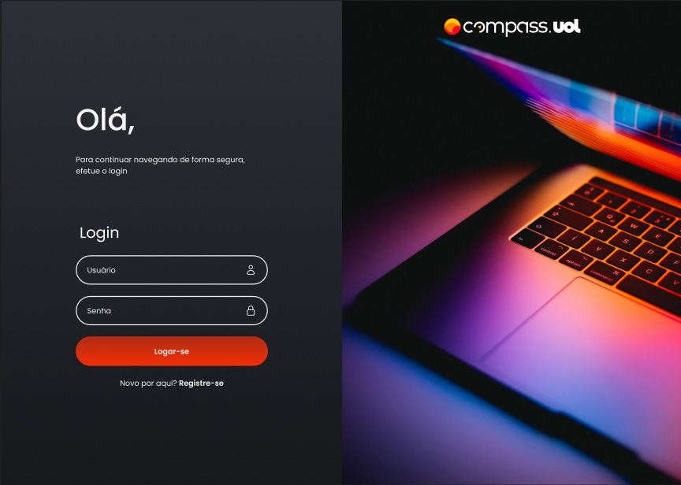
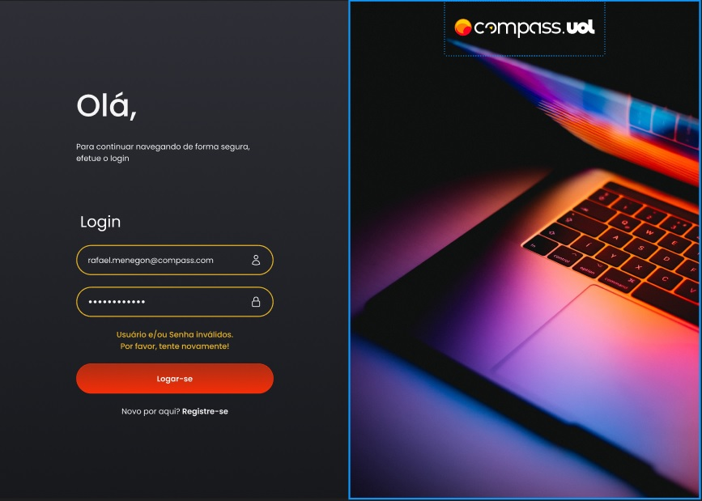
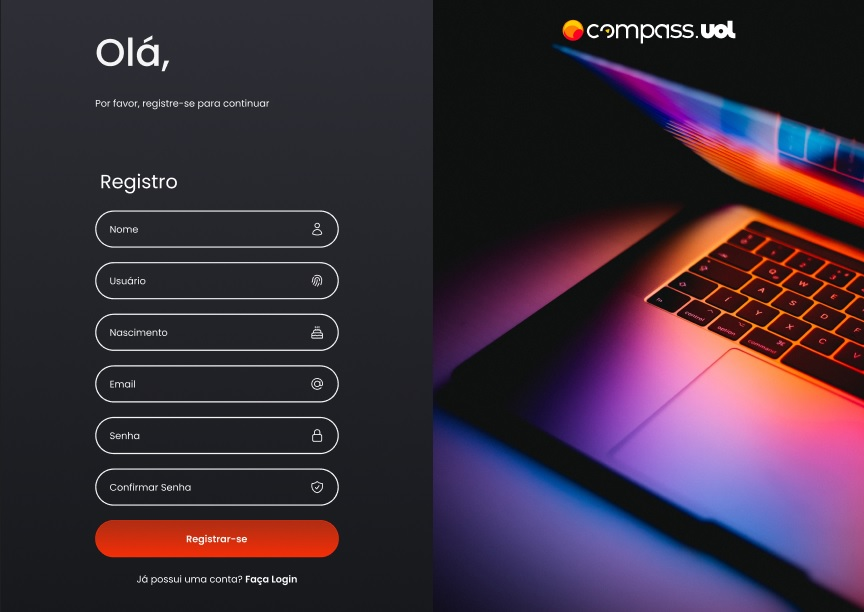
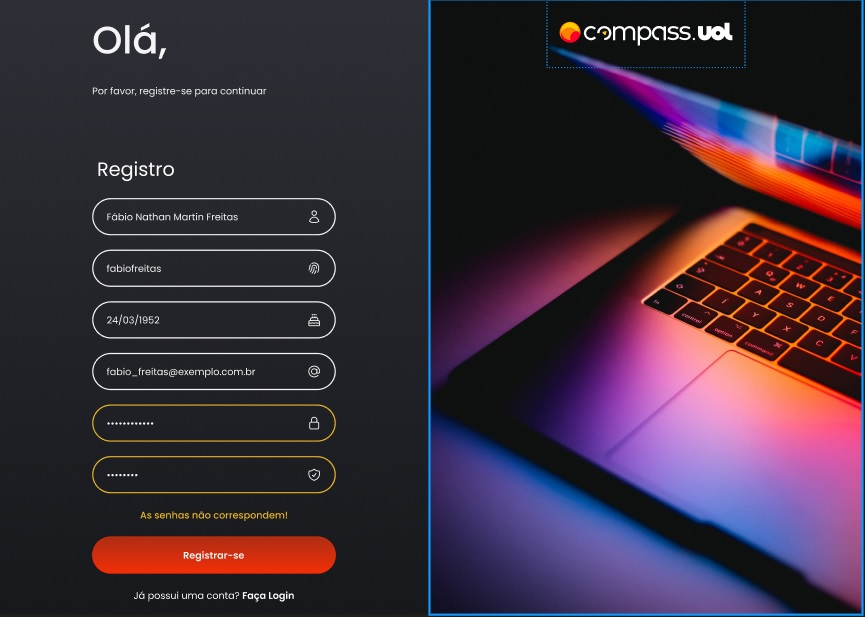
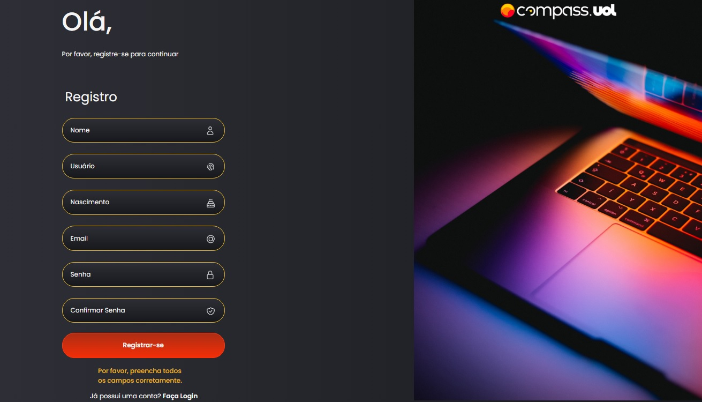
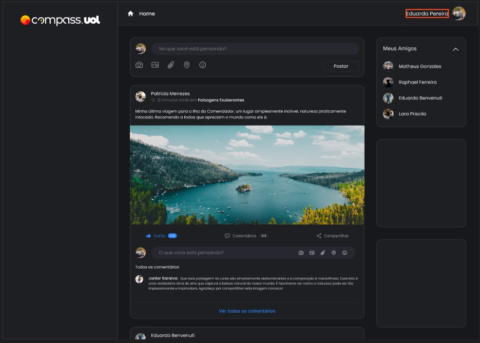

# README - 12th Week Challenge - COMPASS.UOL Internship
Development of the Compass UOL SOCIAL homepage. Continuing with the previous challenges, we implemented a real API for the frontend to consume. For the persistence layer (Database) we use MonogDB. We left the entire user registration part functional, that is, every new user registered is saved in the respective database. We also left the user login functional, that is, every time a user logs in, he is forwarded to his home page with his data. We developed the CRUD used in the creation, update, delete and searches of social network posts in the API, as well as the CRUD used in the comments made in the posts. We adapted our frontend to consume the backend and the respective routes. 🚀🚀

## How to Run the Application

For this application to work first we must run our backend and then the frontend. To put the backend API into action, we must run the terminal in that folder and as soon as the terminal opens, we must execute the “NPM START” command. After executing the backend API, we must open the frontend folder and run the terminal there as well. After the terminal opens, we must execute the “NPM START” command. After running both commands, our application will open in the browser on the initial LOGIN screen.
If you have a registered user, you must inform your username and password and log in. If you do not have a registered user, you can click on register on the login screen, and register in the application. After registering, you can login normally.
This application was developed with a local database, therefore, for the application to work, it must be "supplied" with 01 (two) local databases. A database containing the following data: name, user, birthdate, email, password and profile_photo; This bank is used for user registration, login and user information used in publications and comments. A second database used to “supply” posts and comments containing the following information: user, description, likes, comments (array), post_date and url_image.
  To test the application, follow the routes used in the backend, as follows:
  
USER

GET – http://localhost:3100/users - Lists all users
POST - http://localhost:3100/users - Create users
DELETE - http://localhost:3100/users/:id – Delete users by ID
GET - http://localhost:3100/users/:id – Search user by ID
PUT - http://localhost:3100/users/:id – Update users by ID

POSTS
GET – http://localhost:3100/posts - Lists all posts
CREATE - http://localhost:3100/posts - Create new post
DELETE - http://localhost:3100/posts/:id – Deletes posts by ID
GET - http://localhost:3100/posts/:id – Search posts by ID
PUT - http://localhost:3100/posts/:id - Update post by ID

After logging in, we can see that the logged in username is displayed in the upper left corner. Below is the list of added contacts and in the center we see the place reserved for posts and comments.
Application developed within 1 (one) week, with some adjustments and refactoring still required.

## Technologies Used
- TypeScript
- React
- NestJS
- MongoDB 

## Difficulties Faced
We found it very difficult to develop using the NestJS framework, as it is a framework that we have never worked with. The first difficulty encountered was making the database “callable” by the API. Then, a point that gave us a lot of work was making the frontend consume the backend, especially with regard to registering new users and user logins.

## Some Images of the Application

[]

[]

[]

[]

[]

[]

[]

